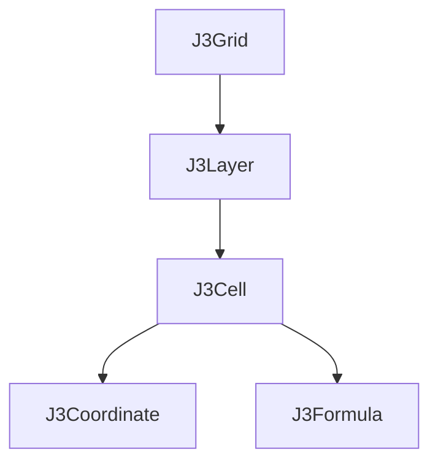

# dog.j3.core

Welcome to the core library for [j3.dog](https://j3.dog).

This library provides data structures and utilities for working with 3D 
grids in TypeScript.

## Installation

To add `dog.j3.core` as a Git submodule to your project, use the following command:

```
mkdir -p src/dog/j3
git submodule add https://github.com/heusalagroup/dog.j3.core.git src/dog/j3
```

This will create a directory `src/dog/j3` and add the `dog.j3.core` repository 
as a submodule within it. You can then use the code within `dog.j3.core` by 
importing it as you would any other module in your project.

## Usage

To use `dog.j3.core`, import the desired functions or data structures from the
library. For example:

```typescript
import { J3Grid, createJ3Grid } from "./dog/j3/core/J3Grid";

const grid: J3Grid = createJ3Grid([]);
```

For a complete list of available functions and data structures, see the API 
documentation in the source files.

## Type relations



## Contributing

Please read [CONTRIBUTING.md](CONTRIBUTING.md)
for details on our code of conduct, and the process for submitting pull requests
to us.

## License

`dog.j3.core` is licensed under the MIT License. See [LICENSE](LICENSE.md) for 
more information.
